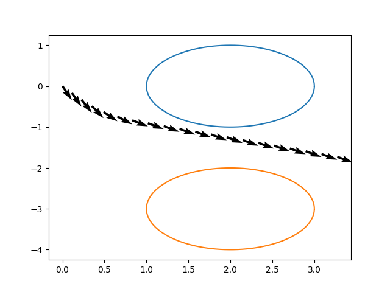
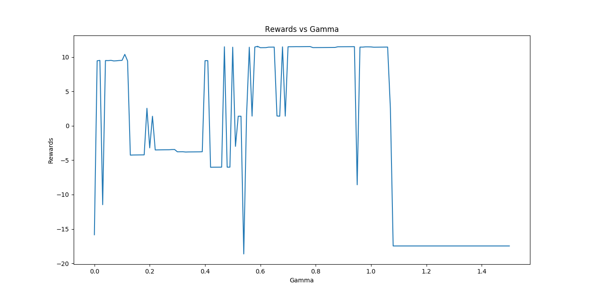
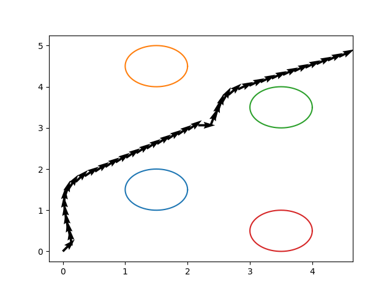
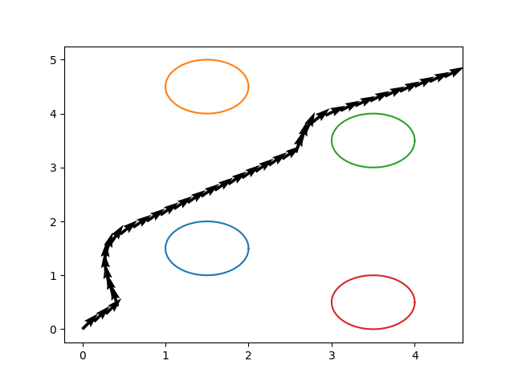
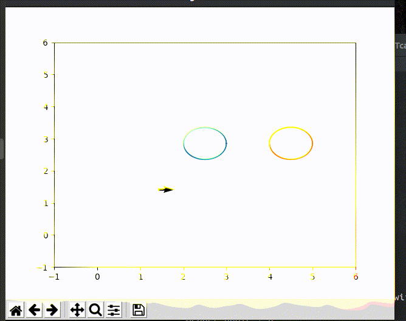

# PETcat - Obstacle Avoidance

## Path Planning with Gaussian Potential Maps
The code can be found <a href = "/obs-avd">here</a>. 
To determine the optimum value for gamma, we assigned rewards for a path; depending on the number of collisions with obstacles, the number of steps required to reach the goal and whether the agent was able to reach the goal under a threshold number of steps. 
Preliminary tests showed that the value for gamma should lie between 0 and 1.5. 
### Results :
##### Test 1 
[Moving from (0,0) to (4,-2)] 
 
  Best Path (Gamma = 1.47) :  
 

##### Test 2
[Moving from (0, 0) to (5, 5)]  
 
  Best Path (Gamma = 0.59) :  
 

Both environments work well with Gamma = 1  
 
 

### With Mobile Obstacles
We realised the need to use lower values for Gamma. 
Best Path : Gamma = 0.59 
 

\# TO DO
  1. Improve the reward metrics
  2. Path determination for mobile obstacles.
